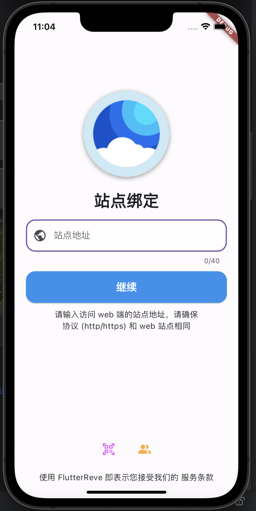
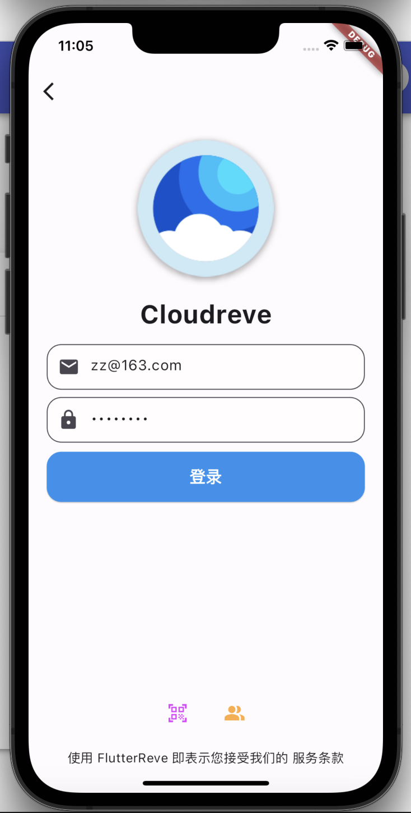
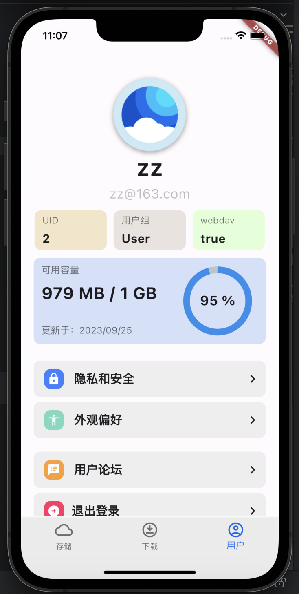
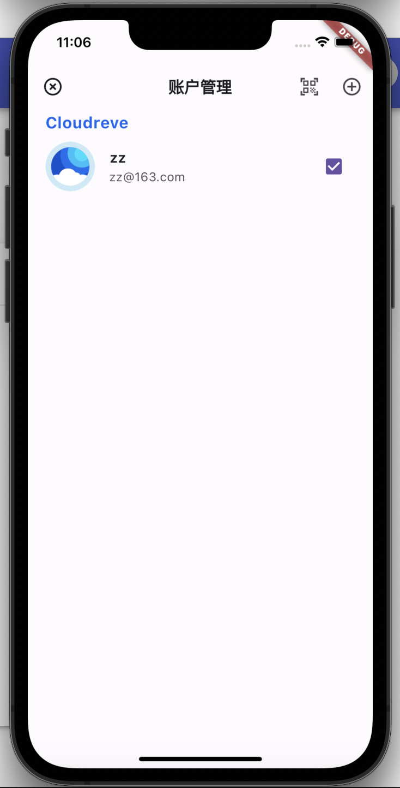
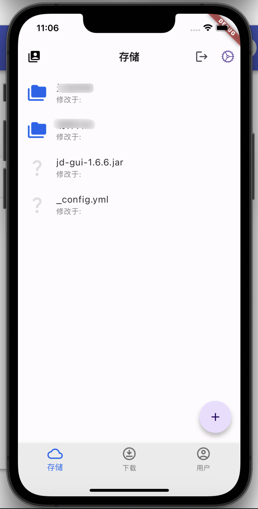
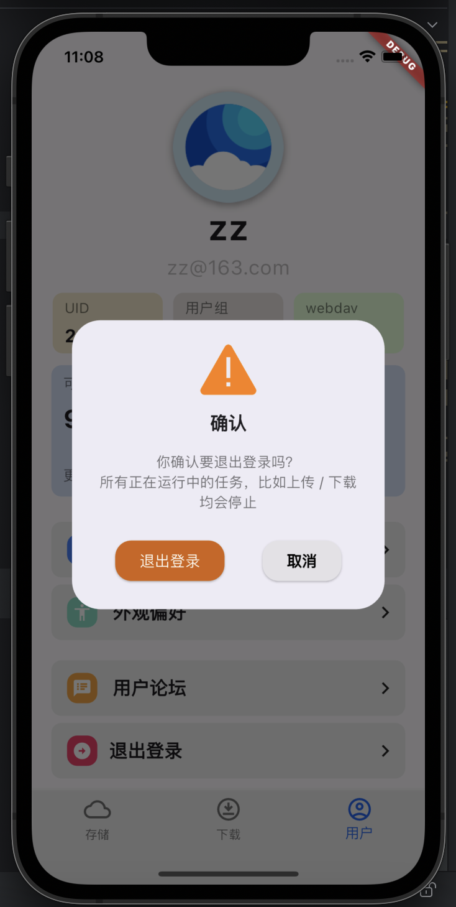
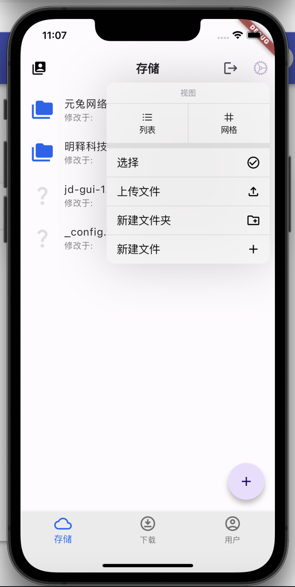

	

<h1 align="center" style="margin: 30px 0 30px; font-weight: bold;">FlutterReve</h1>
<h4 align="center">自己开发的CloudReve手机客户端</h4>

	
	
	
	
	
	
	

---

## 前言：

- 注：学习测试请拉取 master 分支，dev 是开发分支，有很多特性并不稳定（在项目根目录执行 `git checkout master`）。
- 欢迎二开，开源不易，点个 star 鼓励一下吧，这对我来说很重要！

## FlutterReve 介绍

鉴于CloudReve的客户端要收费，并且有手机端的使用需求，本人学了两天flutter就开始上手了。。很多功能还没开发完成，会逐步完善。

鉴于flutter学习时间比较短且作为一个后端程序员，请对代码规范以及使用方式多多包涵

### 实现功能

- [x] 绑定登录
- [x] 站点多用户绑定
- [x] 文件夹浏览
- [x] 基础UI
- [ ] 文件在线查看内容
- [ ] 文件离线查看
- [ ] 文件上传、下载

## 演示效果

## 😎 开源协议

[MIT License](https://gitee.com/zhijiantianya/ruoyi-vue-pro/blob/master/LICENSE) 开源协议，个人与企业可 100% 免费使用，放心二开。

## 交流群

微信交流群：

 

加入群聊的好处：

- 第一时间收到项目更新通知。
- 第一时间收到项目 bug 通知。
- 和众多大佬一起互相 (huá shuǐ) 交流 (mō yú)。

